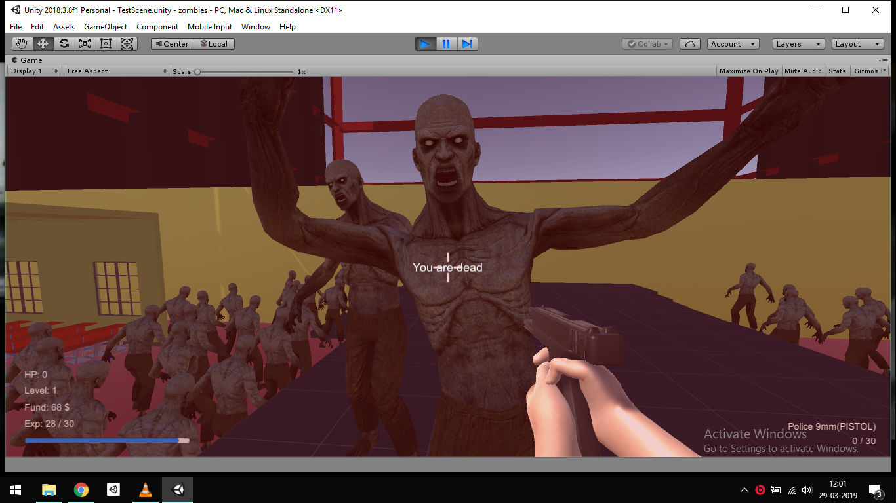

# Unity Zombie FPS 
This is zombie defence fps game. Kill the zombies to obtain the cash and upgrade your weapon or buy powerful weapons!

## Screenshots

## Features
- Extended Standard FPSController: Recoil, Fixing Jump related glitches
- Weapon Sway, Weapon Bobbing
- Endless Zombie offense
- Used Unity's NavMeshAgent for Path finding
- Weapon Buying System
- Weapon Upgrading System
- Raycast Shooting System(Feat. Shotgun)
- Raycast Environment interaction(Shops)
- Global Asset managers (Prefab/Sprite/Sound/Globalsound Managers)
- All models were made and rigified from Blender(Except zombie prefab from Asset store)

## Control
- WASD: Basic movements
- R: Reloading
- M1/Ctrl: Fire
- M2: Aiming
- L-Shift: Sprinting
